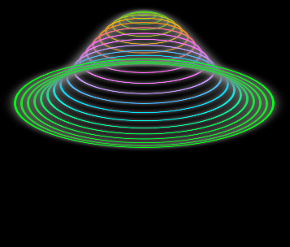

# 3D Circle Animation

A simple HTML & CSS project that creates a **3D circle animation** using only CSS animations and transformations.

## 📸 Preview
  

## 🚀 Live Demo
🔗 [View Animation](https://patience520700
.github.io/3d-circle-animation/)

## Features
- Pure **HTML & CSS** (no JavaScript required)
- 3D rotating circle effect
- Smooth animation with hue rotation and glowing effect
- Fully responsive design

## Project Structure
- `index.html` → Main file containing HTML and CSS

## How to Run
1. Download or clone this repository.
2. Open the `index.html` file in any modern web browser.
3. Enjoy the animation!

## Preview
The project displays multiple glowing circles that move in a 3D space, creating a smooth looping animation.

## Technologies Used
- HTML5
- CSS3 (animations, transforms, shadows)